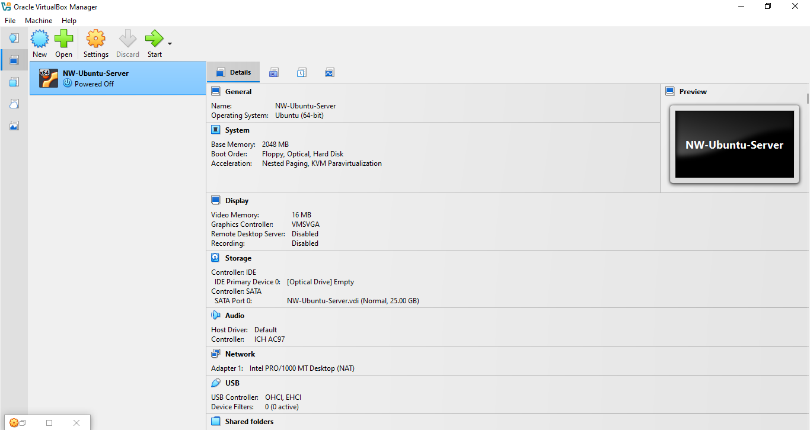

# Lab 01B — Oracle VirtualBox Setup

## Objective

Install Oracle VirtualBox and create the first Ubuntu Server virtual machine for the Enterprise Home Lab.

## Software

* Oracle VirtualBox
* Windows 10 Home (Host)

## Virtual Machine Configuration

| Setting   | Value               |
| --------- | ------------------- |
| Name      | NW-Ubuntu-Server    |
| Type      | Linux               |
| Version   | Ubuntu (64-bit)     |
| Memory    | 2048 MB             |
| Processor | 1 CPU               |
| Storage   | 25 GB VDI (Dynamic) |
| Network   | NAT                 |

## Screenshots

VM created and visible in VirtualBox Manager:

Memory allocation configured:

Network adapter set to NAT:

## Notes

This VM will be used for Linux administration, SSH, networking, logging, and Canonical practice labs.