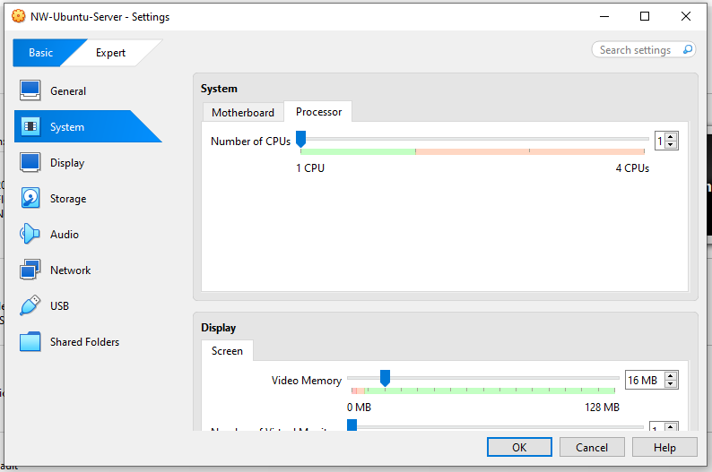
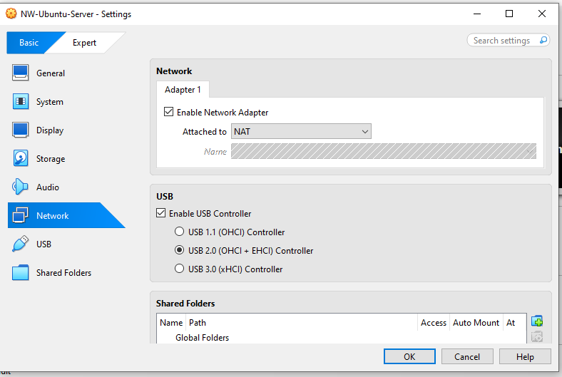
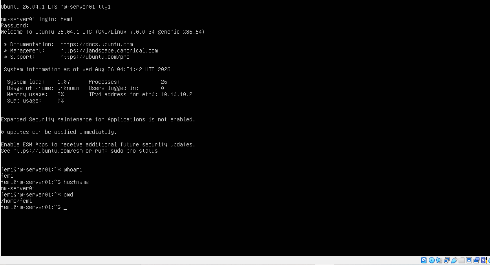
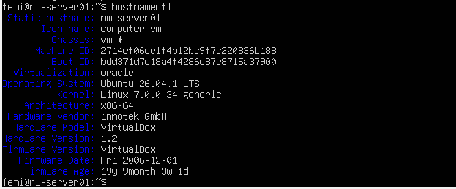
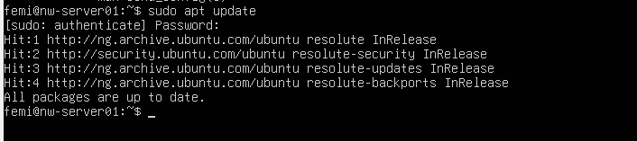
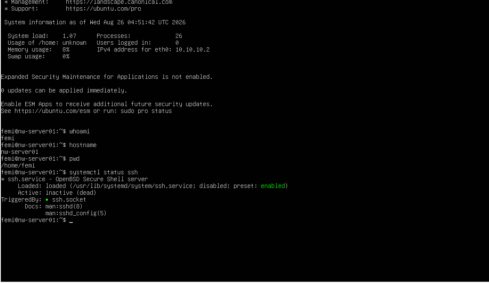

# Lab 01C — Install Ubuntu Server 24.04 LTS

## Objective

Install Ubuntu Server 24.04 LTS inside Oracle VirtualBox and prepare it for Linux administration labs.

## Environment

- Host OS: Windows 10 Home
- VirtualBox Version: Latest
- VM Name: NW-Ubuntu-Server
- RAM: 2048 MB
- CPU: 1 Processor
- Disk: 25 GB (VDI)

## Installation Choices

| Setting | Value |
|---------|-------|
| Language | English |
| Keyboard | English (US) |
| Installation | Ubuntu Server |
| Storage | Guided - Entire Disk |
| Server Name | nw-server01 |
| Username | femi |
| OpenSSH Server | Installed |

Confirmed the VM's memory and network settings before installation:





## Installation and First Login

After completing the installer, the system rebooted to the login prompt:


Logged in successfully for the first time:



Confirmed the server hostname was set correctly:



## First Commands Executed

```bash
whoami
hostname
pwd
ls
sudo apt update
sudo apt upgrade -y
```

Ran the update and upgrade to bring the system current:



Confirmed OpenSSH was installed and running, enabling future remote access:



## Results

Successfully installed Ubuntu Server and completed the first login.

## Skills Learned

- Linux installation
- Creating users
- Hostname configuration
- Command line login
- Updating packages
- Installing OpenSSH